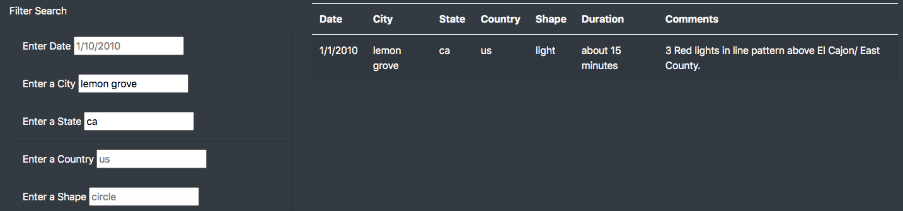

# UFOs

## Project Overview
Aggregate UFO sighting data and provide user the ability to filter this data based on key sighting parameters

## Results
The webpage consists of 5 different search parameters for narrowing and analyzing UFO sighting data (Date, City, State, Country and Shape). User can enter a specific value that they're interesting in analyzing within the search fields provided and the results will be filtered based on their area of interest. There are also suggested input text provided in each of the search fields to help the user identify what type of value to enter. 

the image above shows that there was a UFO sighting in Lemon Grove, CA on Jan 1st, 2010 that lasted 15 minutes. The webpage also includes comments for each sighting as shown in the image above.

## Summary
One potential limitation of this web design is that it only allows for filtering across these 5 dimensions so two recommendations for enhancements are -

1) Enable additional parameters such as including a date range to enable more flexibility in analyzing sightings within a particular month/year
2) The webpage source data could be cleaned up in order to capitalize cities, states and countries to improve user experience and increase website credibility
